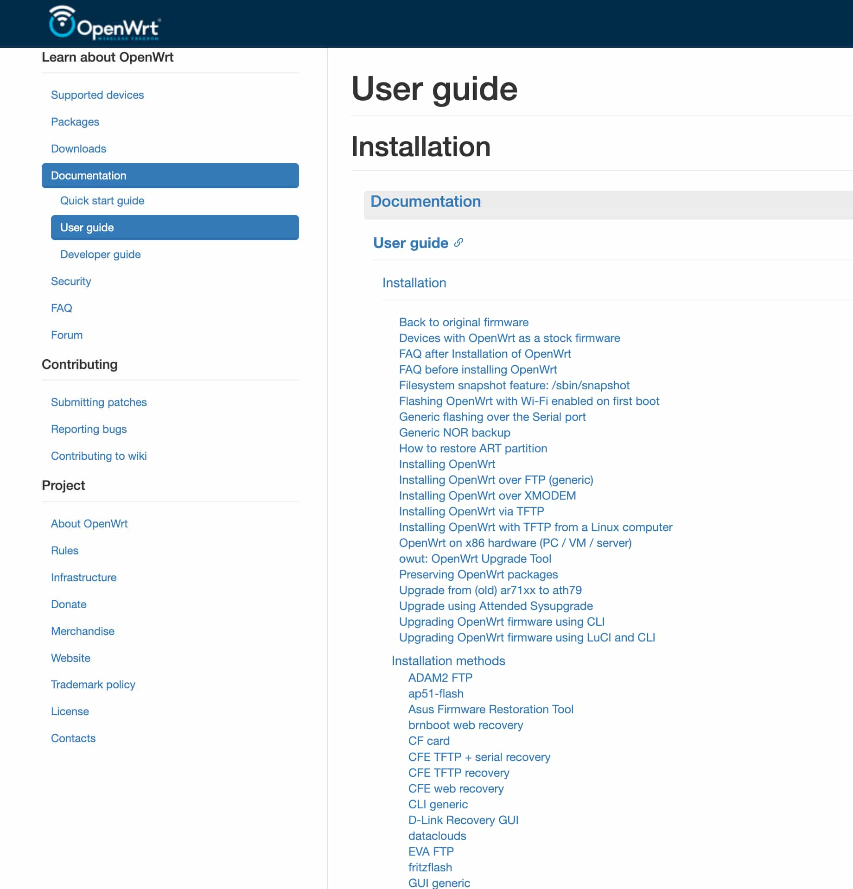

So-o-o, I'm a bit of a smart home nerd and I also hate the idea of a proprietary box doing who knows what with my network. I've known about the OpenWrt project for a while and always wanted to try it, but never had any compatible hardware.

This quickly changed when I switched providers. Odido ships Zyxel routers to their customers, so I looked them up in OpenWrt's Table of Hardware, and to my delight, they were compatible! With caveats, as usual.

I obviously wasn't going to flash custom firmware on a router that I don't even own, so instead I grabbed another one of the same model second-hand for cheap. Thankfully, it somehow had a firmware version that wasn't borked by Odido (`V5.70(ACEA.0)T56C_b7_1006`), so I could follow the safer installation guide that didn't require opening up the router and messing with the serial port. Then the nightmare started…

## Installing OpenWrt

This section is written for my future self while I still remember the steps, and also maybe for someone else who stumbles upon it while looking up error messages they got by following the guide. If you're not interested in the detailed steps and commands, feel free to skip to the [next section](#how-do-i-internet).

The guide I was following is linked on the [main device page of this router](https://openwrt.org/toh/zyxel/t-56#installation) on the OpenWrt wiki, with the link _"Serial-free flashing via the Odido firmware"_. The guide was written by someone under the name `thehybrid1337` — my **massive** gratitude to that person! Even though I stumbled a bit while following the guide, I would have no hopes of ever figuring out something this complex on my own.

The guide had a section titled **Important before flashing**, and I remember reading it and my brain just turning off. Sure, it's important, but I don't understand it! Here's what it said:
- "Make sure you're connected to LAN2" — uh, I have a Macbook, it doesn't even have an Ethernet port! I decided to ignore it and just connect wirelessly. This will turn out to be a _pretty big mistake_.
- "You will need to set up a TFTP-server and adjust your network adapter to have a static IPv4-address instead of DHCP" — uuuhhhhhh, I know these words individually, but what the hell do they mean in this order? Do I really have to set up a TFTP server? Is there no way around it? (there isn't).
- "You will need to rename openwrt-24.10.0-mediatek-filogic-zyxel_ex5601-t0-ubootmod-initramfs-recovery.itb to exclude the release version" — which release version?! 😭

And then it lists some parameters, for which there was simply no capacity left in my brain. Whatever, I'll figure it out later, I thought to myself.

<aside>

Having done it all now, I, of course, understand what it all means. Hey, past me, don't worry, let me explain.

You will need to connect to the router with an Ethernet cable because at some point you will flash a temporary firmware image package (FIP) that is programmed to start polling 192.168.1.254 in hopes of reaching a TFTP server to download a file with a predetermined filename `openwrt-mediatek-filogic-zyxel_ex5601-t0-ubootmod-initramfs-recovery.itb`. Go buy yourself a USB-C LAN adapter.

See how that filename above doesn't contain `24.10.0`, the version of OpenWrt? That's the release version they were talking about, removing the version from the filename allows them to hardcode the filename and have the installation process be version-independent.

You will need to [set up a TFTP server](https://bacnh.com/howto-start-tftp-server-on-macos/), but there is a preinstalled one on Mac. Just run the following commands:

```bash
chmod -R 777 /private/tftpboot  # that is the location that is served by the built-in TFTP server
cp openwrt-blah-blah-recovery.itb /private/tftpboot  # put your recovery image there
chmod 777 /private/tftpboot/openwrt-blah-blah-recovery.itb  # make it readable by the TFTP daemon

sudo launchctl load -F /System/Library/LaunchDaemons/tftp.plist  # start the server
```

Now the only thing left is to make your laptop request the IP address 192.168.1.254 from the router when you're connected to it over an Ethernet cable. In System Settings, go to Network, then below you will see the USB LAN adapter that you have plugged in. Click it, then Details, then TCP/IP. Configure the IPv4 address manually, enter 192.168.1.254 as the IP address, 255.255.255.0 as the mask, 192.168.1.1 as the router address.

</aside>

The [publicly available default password](https://forum.openwrt.org/t/adding-openwrt-support-for-zyxel-ex5601-t0/155914/815#p-1175536-login-6) to the supervisor account didn't work the first time because I already logged into the router the first time. They don't lie when they say you should factory reset the router (which, by the way, you can do in the _Maintenance/Onderhoud_ section of the popup menu on the right).

Then I went through the steps in the Zyxel admin smoothly, except for the part where you have to override JS in the browser devtools — it's no longer enough to hit Cmd+S on a file to save the override, you now have to right-click the file name and click _Override content_ and pick a folder to save the override (you can delete it later).

Then comes the SSH connection. The screenshot in the instruction shows a Windows SSH client, but your regular old command-line SSH works just fine:

```bash
ssh supervisor@192.168.1.1
```

According to another instruction post on this router's forum discussion, the root password (confusingly titled _supervisor password_, not to be confused with the publicly known supervisor password) is unique per device and not regenerated:

> I recommend you save the root password somewhere. It's unique per device and the algorithm to generate it is not present in the firmware (I checked).
> 
> <cite>https://forum.openwrt.org/t/adding-openwrt-support-for-zyxel-ex5601-t0/155914/1101</cite>

By the way, the author of that post uses Firefox, so they can offer some help with the JavaScript override trickery.

<aside>

Hey, is that the OpenWrt logo in the SSH console? But I didn't flash OpenWrt yet! Did Zyxel just jack OpenWrt's firmware and rebrand it as their own, in violation of the GPL-2.0 license?

</aside>

Then comes a moment to copy a file to the router using SCP. The instructions' author used WinSCP that apparently has a protocol setting with an option "SCP". When I tried a regular `scp` command in the terminal, it failed due to the lack of SFTP support, I assume, on the router side. This error was fixed by switching `scp` to legacy mode with `-O` (capital letter O):

```bash
scp -O *.fip root@192.168.1.1:/tmp
```

I flashed the FIP, made sure to start the TFTP server on my laptop, rebooted the router… and that's when it hit me. If the router isn't running, then I'm not connected to it, so how is it going to fetch files from my laptop over TFTP, exactly? Dammit. Gotta buy that LAN adapter after all.

_(one LAN adapter later)_

Okay, I got the OpenWrt recovery running, copied over the rest of the files, then ran the command to install the kernel mod:

```bash
opkg install /tmp/kmod-mtd-rw_6.6.73.2021.02.28~e8776739-r1_aarch64_cortex-a53.ipk
```

And it failed with this error:

```bash
openwrt packages for kmod-mtd-rw found, but incompatible with the architectures configured
```

People on the internet claimed it's because I was installing a snapshot version, but I wasn't, I was installing a stable version! Anyway, turns out, I had an outdated kmod for 24.10.0 while I was installing 24.10.4. I downloaded the latest one from https://downloads.openwrt.org/releases/24.10.4/targets/mediatek/filogic/kmods/, searching by "kmod-mtd-rw".

And that was bascially it, the rest of the installation didn't cause me any trouble.

<aside>

Ah, wait, no, there was one thing that threw me off a little bit. The very next command after this one, according to the instructions, is this:

```bash
insmod mtd-rw i_want_a_brick=1
```

Obviously, I don't want a brick! I couldn't tell at first if this was the instructions' author messing with me or if this was genuinely an important step. After some searching on the internet, I'm convinced that this is a genuine step, but wow, talk about user experience!

</aside>

Before I knew it, the router was running OpenWrt!

Oof, _that's_ OpenWrt?

## How do I internet?

OpenWrt greets me with ~~open arms~~ cryptic interface names! DHCP leases! Stations and radios! How the hell do I set up a name and a password for my Wi-Fi network?

Now look, I'll admit that I haven't done any research into OpenWrt except for knowing what it is broadly. I could have definitely prepared better. I'm also not a network engineer, I'm a web developer, I don't know what to do with a network switch. That said… I'm not exactly a layperson either, I took a university course on networks, I've poked around interfaces when setting up Wi-Fi on a fresh install of Arch Linux, I know a lot of stuff! 

I was terrified when I first opened the admin panel of OpenWrt. I tripped and stumbled my way into the Wireless settings and then looked in shock at the two radios that only differ in the combination of random letters after 802.11! I had to assume that one of them is the 2.4GHz and the other one is 5GHz, then I went to configure them and oh no, a dialog full of fields with technical names that I now have to guess correct values for! And guess what, I guessed incorrectly with the 2.4 GHz and then wasted an hour trying to get my smart home gizmos to connect to the network that I can easily connect to with my phone!

There is [documentation on how to set Wi-Fi up](https://openwrt.org/docs/guide-quick-start/basic_wifi), too bad I didn't find it because when I opened the user guide, it looked like this:



What the hell am I supposed to click first here? This is not a user guide, this is a corporate Confluence full of random documents!

Oh and silly me for not finding that guide because while I was configuring the Wi-Fi networks, I changed the default set of interfaces (only LAN) to also include WAN (and WAN6 because I didn't know the difference). That thing that you should explicitly NOT DO, according to the troubleshooting section. Why did I do it? Well, duh, I want my Wi-Fi to be able to access the internet!

After I had successfully set up my Wi-Fi networks for 2.4 and 5 GHz and could connect to them, I realized that the internet still doesn't work. The WAN interface has a red background and I don't know what to do. It's times like these that I'm really thankful that someone has compressed all of internet into an LLM that I can complain about my problems and it will help me.

So what's the solution, how do I internet? Well!

1. Go to Interfaces and add a new interface. Call it `wan_vlan`, for example, leave the protocol to be "DHCP client", and instead of choosing an existing device, type into the Custom textbox the magical incantation `eth1.300`. You have invented a device that doesn't exist on your router, surely that's the start to getting internet flowing!
2. Edit your WAN interface to use that new `eth1.300` device.

That's it! What's the `eth1.300`, you ask? Well, it's a way to mark your traffic with a VLAN ID of `300` (this is not a random number, [it's defined by Odido](https://openwrt.org/docs/guide-user/network/wan/isp-configurations?s[]=menu&s[]=support&s[]=register#odido)), which is how Odido knows what to do with it. Or something like that, network engineers, don't `@` me.

After I did that, the router could reach internet, but my laptop still couldn't. Turns out, it was because I accidentally set the DHCP settings on the laptop for my router's network to be Manual and to request that hardcoded IP address for the TFTP server. Once that was removed, internet started flowing, mercifully.

## Can we do better?

Of course, we can do better. I saw a thread on Reddit where the poster was complaining about the complexity of the built-in UI in a reasonable manner. The responses were full of people saying how they actually like it this way because it gives them control, saying how UIs that come with consumer routers are actually bad and keep people ignorant, saying how it's the poster's fault and they should learn some networking first. Seeing this thread has made me genuinely sad.

This is a glaring accessibility issue. When people talk about accessibility of UIs, they usually talk about compatibility with screen readers or keyboard navigation, but this is accessibility too. I had a headache the day I was setting all this up, I was at someone else's house because I borrowed their LAN adapter, I had things I needed to do, people who waited for me, places I needed to be. Even with mountains of great knowledge in the wiki and the forums, even with my needs being in the 99.9% of needs from consumer routers, I couldn't set this router up quickly. All of this knowledge and power of OpenWrt was _inaccessible_ to me.

Can I do better? OpenWrt is an open source project that is run by unpaid volunteers. I could put my money where my mouth is and create an admin panel the way I think it should be. It wouldn't even be that much friction — OpenWrt already knows of [several alternative UIs](https://openwrt.org/docs/guide-user/luci/webinterface.overview) that all co-exist peacefully and are all listed in the wiki, no need to make PRs and fight resistance from die-hard fans of the default UI. I'm writing this at a time when LLMs have become quite good at coding, and it wouldn't be out of my reach to build a web server that issues CLI commands in response to form submissions, and I could design it however I want. I could even build the server in a compiled language to save on disk, memory, and CPU usage, even though I've never written web servers in C or Rust.

I won't do it though. Maybe one day, but let's build one great thing at a time. I'm already building another great thing.

I would like to take the opportunity to thank the creators and active members of the OpenWrt community. I really want to see routers become open-source and unlocked, and you're making this a reality.
